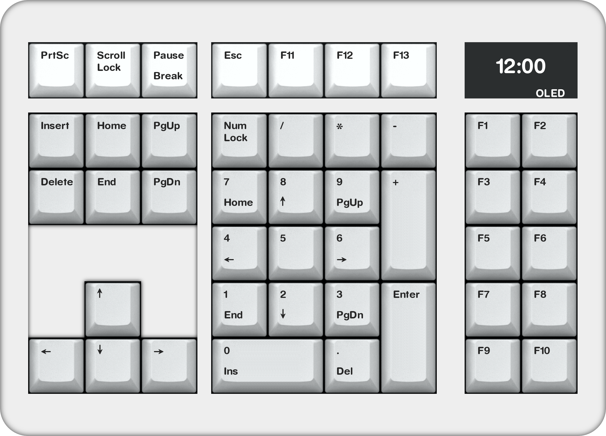
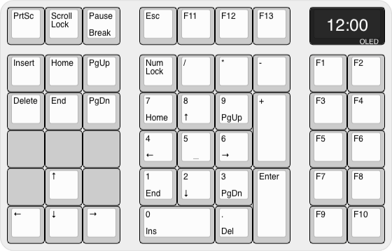

# VR44-Keyboard-PCB

> &#128679; `Placeholder for future project` &#128679;  
> &nbsp; &nbsp; &nbsp; &nbsp; &nbsp; &nbsp; &nbsp; &nbsp; &#9888;&#9888;&#9888;&#9888;&#9888;&#9888;&#9888;&#9888;&#9888;&#9888;  
> &nbsp; &nbsp; &nbsp; &nbsp; &nbsp; &nbsp; &nbsp; &nbsp; &#9888; ***DO NOT BUILD*** &#9888;  
> &nbsp; &nbsp; &nbsp; &nbsp; &nbsp; &nbsp; &nbsp; &nbsp; &#9888;&#9888;&#9888;&#9888;&#9888;&#9888;&#9888;&#9888;&#9888;&#9888;  
> &#128679; `==============================` &#128679;

## Intent

A macro-pad / num-pad cluster **companion** keyboard with QMK f/w, *for those who use 60% keyboards but need a num-cluster*

## Layout ideation renders

#### Render

#### Layout

## Planned Features

- [ ] QMK build
- [ ] MCU *undecided* *(maybe RP2350, depending on QMK support)*
- [ ] C3/4 UDB Usb-C
- [ ] USB PD Sink controler for 5V-3A Power Delivery
- [ ] Built in USB-Hub, 3-port.  Two back, one on right side
- [ ] OLED Screen
- [ ] Battery backed-up RTC for time
- [ ] Temperature sensor
- [ ] All 2U keys have 2x 1U options *(hotswap)*
- [ ] Additional optional keys arround the arrow cluster

## Wish List

- *undecided*
- *(maybe ESP32 Tasmota support -- overkill, maybe not)*

## Possible BIG issues

- *Way to far in the futire to know*

---
Made with &#9829; by Vino Rodrigues
