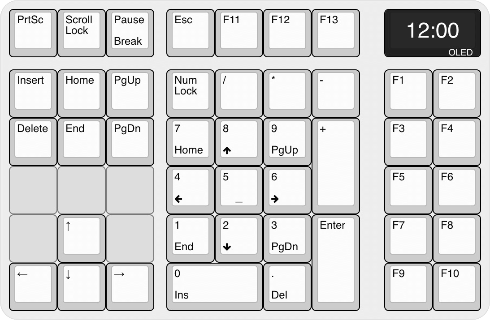

# VR44-Keyboard-PCB

## Intent

A macro-pad / num-pad cluster **companion** keyboard with QMK f/w, *for those who use 60%/70% keyboards but need a num-cluster*.  Also something for thoes extra key-caps to do.

## Layout ideation renders

#### Render

#### Layout

#### Matrix

## Planned Features

- [ ] QMK build
- [ ] MCU `RP2350` *(Depending on QMK support.  Keep track: [#24346](https://github.com/qmk/qmk_firmware/pull/24346) )s*
- [ ] C3/4 UDB Usb-C
- [ ] Hotswap MX ~~or Choc~~ switches ~~*(dual support. MAYBE NOT)*~~ *<small>[Hotswap dual not viable]</small>*
- [ ] 5 x positions for Skyloong Rotary Encoder *(with all 5 in concurrent use capability)*
- [ ] USB PD Sink controller for 5V-3A Power Delivery. `HUSB238` ~~*or*~~ ~~`TPS25730`~~ ~~*or*~~ ~~`STUSB4500`~~
- [ ] Built in USB-Hub, 3-port.  Two back, one on right side.  `CH334F`
  - with option to off-line the Hub but keep the KB working. Needs `TS3USB221`
- [ ] OLED Display screen module.
  - White *(a.k.a. 0.91-inch OLED)* *or* Color *(?? imposible to find)*
  - 128x32 resolution 
  - 19 x 33 mm (0.75 x 1.5 inch) &#177;Max size
- [ ] Battery backed-up RTC for time display. `DS1307`
- [ ] Temperature sensor. `DS18B20`
- [ ] All 2U keys have 2x 1U options *(hot-swap)*
- [ ] Additional optional keys around the arrow cluster
- [ ] `AST1109MLTRQ` buzzer.  *(For builtin alarm function, MAYBE?)*

## Wish List

- Add WiFi automation module *(for remote macro keypress, e.g. shutdown macro)*
  - [Tasmota](https://github.com/arendst/tasmota) on `ESP8684-WROOM-02C`/`-02UC` *(a.k.a. [`ESP32-C2`](https://www.espressif.com/en/products/socs/esp32-c2))*
  - *or*, [ShellyX](https://x.shelly.com/)

## Possible BIG issues

- Stacking the electronics features - may not have space on the PCB
- `RP2350` not on ChBios yet, so not on QMK

&nbsp; &nbsp;

---
Made with &#9829; by Vino Rodrigues
